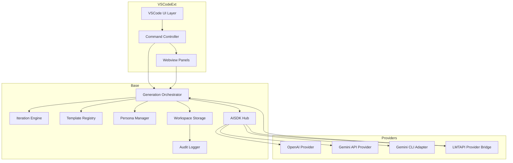
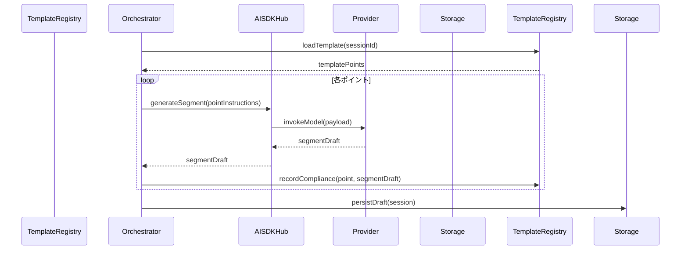
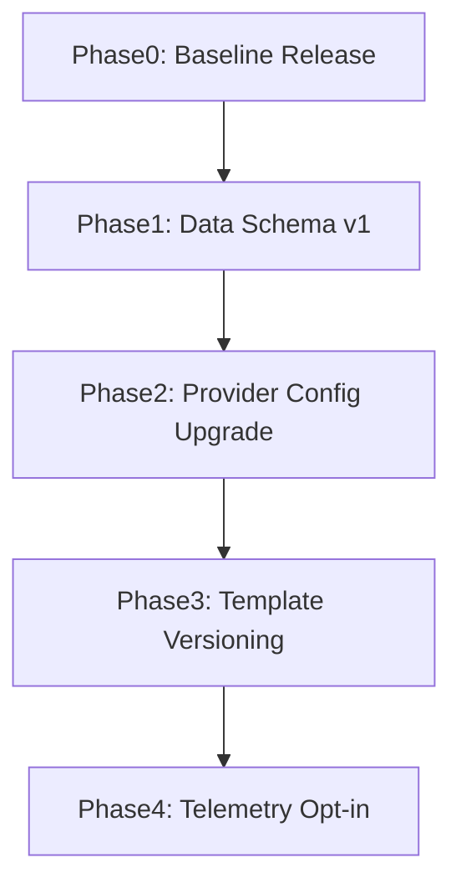

# Design Document

## Overview
AI Writer拡張は、VS Code上でアイデア入力から文章完成までを自律反復ワークフローで支援し、テンプレート化されたスタイル適用と複数AIプロバイダーの切り替えを可能にする。対象ユーザーはコンテンツプランナー、ライター、編集者であり、ワークスペース内の原稿やテンプレートをGitで管理しながら質の高い文章生成を行う。
本設計では、基盤ロジックを共有できるBaseレイヤー、VS Code UI/コマンドを担うVscode-extレイヤー、Language Model Tool API連携を担うLMTAPI-vscodeレイヤーに分離し、Vercel AI SDKによるモデル抽象化とVS Code Language Model Providerの連携を統合する。
反復サイクル（生成→批判→考察→質問→再生成）を各フェーズで強制するステートマシンを中心に、テンプレート・パーソナライゼーション・バージョン管理を横断的に扱う。

### Goals
- 反復的なアウトライン/文章生成フローをBaseレイヤーで再利用可能に提供する。
- OpenAI/Gemini API、Gemini CLI、Language Model Tool APIの三系統プロバイダーを統一インターフェースで制御する。
- VS Code上でテンプレート編集、進捗管理、履歴比較を可能にする拡張UIを実装する。
- テンプレート指示とパーソナライズ情報をポイント単位でAI推論に適用し、遵守状況を可視化する。

### Non-Goals
- 外部CMSや配信プラットフォームへの直接公開機能。
- 大規模協調編集（リアルタイム同期）は対象外。
- VS Code以外のIDE向けUIは提供しない。
- モデル学習やファインチューニング機能は実装しない。

## Architecture

### Existing Architecture Analysis
既存コードは存在せず、ステアリング情報も未提供（`.kiro/steering/`空）。プロジェクト標準は本設計で初期定義する必要がある。

### High-Level Architecture



**Architecture Integration**:
- 既存パターン: レイヤードアーキテクチャを採用し、Baseを純粋なサービス層として定義。
- 新規コンポーネント: AISDKハブ（プロバイダー登録・ルーティング）、テンプレートレジストリ、VS UIコントローラ。
- 技術整合性: TypeScript/Node 18、Vercel AI SDK、VS Code LM API、pnpmワークスペース構成。
- Steering準拠: ステアリング不在のため、本設計で初期ガードレールを提示。

### Technology Stack and Design Decisions

#### 技術スタック
- **ランタイム**: Node.js 18 (ES2022, VS Code拡張互換)
- **言語/型**: TypeScript (TSConfig strict, noImplicitAny)
- **AIクライアント**: Vercel AI SDK (`@ai-sdk/openai`, `@ai-sdk/google`)、`ai`コア
- **CLI統合**: Gemini CLI（`npx @google/generative-ai`）をchild_process経由で呼び出し
- **VS Code API**: Language Model Chat Provider / Tool API 1.95+
- **データ永続化**: ワークスペース内`.ai-writer/`（JSON/YAML）+ Git
- **ダイアグラム/ビュー**: VS Code Webview (React/Vanilla)、TreeView API
- **設定**: VS Code `ConfigurationTarget.Global/Workspace`
- **パッケージ管理**: pnpmワークスペース（Base/Vscode-ext/LMTAPI-vscodeのマルチパッケージ構成）

#### 主要設計判断
- **Decision**: Vercel AI SDKのプロバイダー登録機構を中核としたAISDKハブを採用する
  - **Context**: 複数AIベンダーを単一インターフェースで制御する必要
  - **Alternatives**: 各ベンダー純正SDK、RESTカスタムクライアント
  - **Selected Approach**: AI SDKの`createProviderRegistry`と`generateText`/`streamText`をAISDKハブ経由で使用し、OpenAI/Gemini/LMTAPIブリッジを登録
  - **Rationale**: ストリーミング、ツールコール、フェールオーバー支援を単一のレジストリで制御でき、プロバイダー追加も登録処理で完結
  - **Trade-offs**: SDK更新に追随する負荷、SDKが未対応のAPIはハブ内で拡張実装が必要

- **Decision**: 反復フローをステートマシンとしてBaseで実装
  - **Context**: 生成→批判→考察→質問→再生成の順序制御
  - **Alternatives**: UI制御のみ、手続き的チェーン
  - **Selected Approach**: Iteration Engineが状態遷移と検証を担当
  - **Rationale**: 再利用性・テスト容易性向上
  - **Trade-offs**: ステート管理の初期実装コスト増

- **Decision**: Gemini CLIを非同期ジョブとしてアダプト
  - **Context**: CLI経由でしか提供されない環境での互換性確保
  - **Alternatives**: REST APIで代替、サードパーティライブラリ
  - **Selected Approach**: 非同期child_process呼び出し＋JSON出力解析
  - **Rationale**: CLI依存環境でも同一体験提供
  - **Trade-offs**: プロセス起動コスト、CLIバージョン管理が必要

## System Flows

### アウトライン反復フロー
```mermaid
sequenceDiagram
    participant User
    participant VSUI as VSCodeUI
    participant Orchestrator
    participant IterEngine as IterationEngine
  participant AISDKHub as AISDKHub
    participant Provider

    User->>VSUI: アイデア入力
    VSUI->>Orchestrator: startOutlineCycle()
    Orchestrator->>IterationEngine: initializeState("outline")
    IterationEngine-->>Orchestrator: stateReady
  Orchestrator->>AISDKHub: requestDraft(idea, template)
  AISDKHub->>Provider: generateOutline()
  Provider-->>AISDKHub: outlineDraft
  AISDKHub-->>Orchestrator: outlineDraft
    Orchestrator->>IterationEngine: submitStepResult("generate", draft)
    IterationEngine-->>Orchestrator: requireCritique
  Orchestrator->>AISDKHub: requestCritique(draft, template)
  AISDKHub-->>Orchestrator: critique
    Orchestrator->>IterationEngine: submitStepResult("critique", critique)
    IterationEngine-->>Orchestrator: requireReflection
    ... repeat for further steps ...
    Orchestrator-->>VSUI: finalOutline
```

### テンプレート適用ドラフトフロー


## Requirements Traceability

| Requirement | Summary | Components | Interfaces | Flows |
|-------------|---------|------------|------------|-------|
| R1 | アイデアからアウトライン生成 | Orchestrator, IterationEngine, TemplateRegistry, AISDKHub | `GenerationOrchestrator.startOutlineCycle`, `IterationEngine.handleStep` | アウトライン反復フロー |
| R2 | アウトラインから文章生成 | Orchestrator, TemplateRegistry, AISDKHub, Storage | `GenerationOrchestrator.startDraftCycle`, `StorageGateway.saveDraft` | テンプレート適用ドラフトフロー |
| R3 | パーソナライゼーション管理 | PersonaManager, TemplateRegistry, VS Settings | `PersonaManager.upsertPersona`, `TemplateRegistry.applyPersona` | テンプレート適用ドラフトフロー |
| R4 | バージョン管理 | StorageService, AuditLogger, VSCodeUI | `StorageGateway.commitDraft`, `AuditLogger.append` | テンプレート適用ドラフトフロー |
| R5 | 推敲・プロバイダー連携 | AISDKHub, GeminiCLIAdapter, VS UI | `AISDKHub.execute`, `GeminiCLIAdapter.execute` | アウトライン反復フロー |
| R6 | ライティングテンプレート作成 | TemplateRegistry, VSCodeUI, Orchestrator | `TemplateRegistry.createTemplate`, `GenerationOrchestrator.applyTemplatePoint` | テンプレート適用ドラフトフロー |

## Components and Interfaces

### Base Layer

#### Generation Orchestrator
**Responsibility & Boundaries**
- Primary Responsibility: 反復フロー全体の進行、ステート遷移、結果集約。
- Domain Boundary: コンテンツ生成ドメイン。
- Data Ownership: セッション状態、ステップ履歴。
- Transaction Boundary: 1セッション内でのステップ整合性。

**Dependencies**
- Inbound: VS Command Controller, LMTAPI Provider Bridge。
- Outbound: Iteration Engine, Template Registry, Persona Manager, AISDK Hub, Storage Service, Audit Logger。
- External: Vercel AI SDK経由のモデル。

**Contract Definition**
```typescript
interface GenerationOrchestrator {
  startOutlineCycle(input: OutlineInput): Promise<Result<OutlineSessionSummary, OrchestrationFault>>;
  startDraftCycle(input: DraftInput): Promise<Result<DraftSessionSummary, OrchestrationFault>>;
  applyTemplatePoint(sessionId: string, pointId: string, override?: PointOverride): Promise<Result<PointEvaluation, OrchestrationFault>>;
}

type Result<T, E> = { kind: "ok"; value: T } | { kind: "err"; error: E };

type OutlineInput = {
  idea: string;
  personaId?: string;
  templateId?: string;
  historyDepth: number;
};

interface OutlineSessionSummary {
  sessionId: string;
  outline: OutlineDocument;
  auditTrail: StepRecord[];
}

interface OrchestrationFault {
  code: "invalid_state" | "provider_failure" | "storage_error" | "template_error";
  message: string;
  recoverable: boolean;
}
```

**Preconditions**: 入力検証済み、テンプレート存在確認済み。
**Postconditions**: セッション状態が永続化され、必要ログが記録されたこと。
**Invariants**: ステップ順序はステートマシン定義に従う。

#### Iteration Engine
- **Primary Responsibility**: 生成→批判→考察→質問→再生成ステートマシン管理。
- **Domain Boundary**: プロセス制御。
- **Data Ownership**: ステートチャート定義、ルール。
- **Dependencies**: none inbound; outbound: Orchestrator。

**Contract**
```typescript
interface IterationEngine {
  initializeState(mode: IterationMode): IterationState;
  handleStep(state: IterationState, step: IterationStep): IterationTransitionResult;
}

type IterationMode = "outline" | "draft";

type IterationStep = {
  type: "generate" | "critique" | "reflection" | "question" | "regenerate" | "approval";
  payload: Record<string, unknown>;
};

interface IterationTransitionResult {
  state: IterationState;
  nextRequiredStep: IterationStepType | "completed";
  violations: IterationViolation[];
}
```

**State Management**: ステートは不変構造で保持し、無効遷移時は`violations`を返す。

#### Template Registry
- **Responsibility**: テンプレートCRUD、ポイント指示、遵守評価。
- **Dependencies**: Storage Service、Persona Manager。

**Contract**
```typescript
interface TemplateRegistry {
  createTemplate(input: TemplateDraft): Promise<Result<TemplateDescriptor, TemplateError>>;
  loadTemplate(id: string): Promise<Result<TemplateDescriptor, TemplateError>>;
  recordCompliance(sessionId: string, pointId: string, compliance: ComplianceSnapshot): Promise<void>;
}

type TemplateDraft = {
  name: string;
  personaHints?: string[];
  points: TemplatePoint[];
};

type TemplatePoint = {
  id: string;
  title: string;
  instructions: string;
  priority: number;
};
```

#### Persona Manager
- **Responsibility**: パーソナライゼーション設定の抽出・保存・適用。
- **Dependencies**: Storage Service。

**Contract**
```typescript
interface PersonaManager {
  upsertPersona(persona: PersonaDefinition): Promise<Result<PersonaDefinition, PersonaError>>;
  applyPersona(templateId: string, personaId: string): Promise<Result<TemplateDescriptor, PersonaError>>;
}

type PersonaDefinition = {
  id: string;
  name: string;
  tone: string;
  audience: string;
  toggles: Record<string, boolean>;
};
```

#### AISDK Hub
- **Responsibility**: Vercel AI SDK上のプロバイダー登録・実行・フェールオーバー制御を一元管理。
- **Dependencies**: OpenAI Provider、Gemini API Provider、Gemini CLI Adapter、LMTAPI Bridge、`ai`パッケージの`createProviderRegistry`。

**Contract**
```typescript
interface AISDKHub {
  registerProvider(channel: ProviderChannel): void;
  execute(request: ProviderRequest): Promise<Result<ProviderResponse, ProviderFault>>;
  stream(request: ProviderRequest): Promise<Result<ProviderStream, ProviderFault>>;
}

type ProviderChannel = {
  key: "openai" | "gemini-api" | "gemini-cli" | "lmtapi";
  register: (registry: ProviderRegistry) => void;
};

type ProviderRequest = {
  key: ProviderChannel["key"];
  payload: ProviderPayload;
  templateContext?: TemplateContext;
};

type ProviderPayload = {
  prompt: string;
  mode: "outline" | "draft" | "critique";
  maxTokens: number;
  temperature: number;
  toolInstructions?: ToolInstruction[];
};

type ProviderRegistry = ReturnType<typeof createProviderRegistry>;
```

#### Storage Service
- **Responsibility**: `.ai-writer/`以下のセッション、テンプレート、ログ永続化。
- **Dependencies**: Node fs/promises, Git CLI。

**Contract**
```typescript
interface StorageGateway {
  saveSession(session: SessionSnapshot): Promise<Result<string, StorageFault>>;
  loadSession(id: string): Promise<Result<SessionSnapshot, StorageFault>>;
  commitDraft(commitInput: DraftCommitInput): Promise<Result<string, StorageFault>>;
}
```

### VSCode-ext Layer

#### Command Controller
- **Responsibility**: コマンド登録、Orchestrator呼び出し、設定管理。
- **Inbound**: VS Code Command API。
- **Outbound**: Generation Orchestrator, Template Registry。

**Contract**
```typescript
interface CommandController {
  register(context: vscode.ExtensionContext): void;
}
```

#### Webview Panels
- **Responsibility**: 進行状況表示、テンプレート編集UI。
- **Dependencies**: Webview、Message passing。

**Contract**
```typescript
interface ProgressPanelMessage {
  type: "progress" | "critique" | "question" | "error";
  payload: unknown;
}
```

#### Tree/Notebook Views
- Session履歴・テンプレート一覧をTreeViewで表示。Notebook形式でテンプレート編集を検討。

### LMTAPI-vscode Layer

#### LMT Provider Bridge
- **Responsibility**: `vscode.lm.registerLanguageModelChatProvider`実装、Base Orchestratorとの橋渡し。
- **Dependencies**: Generation Orchestrator, AISDK Hub。

**Contract**
```typescript
interface LMTProviderBridge extends vscode.LanguageModelChatProvider {
  provideLanguageModelChatInformation(options: LMTInfoOptions, token: vscode.CancellationToken): Promise<vscode.LanguageModelChatInformation[]>;
  provideLanguageModelChatResponse(model: vscode.LanguageModelChatInformation, messages: readonly vscode.LanguageModelChatRequestMessage[], options: vscode.ProvideLanguageModelChatResponseOptions, progress: vscode.Progress<vscode.LanguageModelResponsePart>, token: vscode.CancellationToken): Promise<void>;
  provideTokenCount(model: vscode.LanguageModelChatInformation, text: string, token: vscode.CancellationToken): Promise<number>;
}
```

#### Tool Registry
- **Responsibility**: `vscode.lm.registerTool`でアウトライン生成、批判、テンプレート適用などをツール化。
- **Contract**
```typescript
interface ToolRegistry {
  registerTools(context: vscode.ExtensionContext): void;
}

type ToolDefinition = {
  name: string;
  description: string;
  inputSchema: vscode.LanguageModelToolSchema;
  invoke: (options: vscode.LanguageModelToolInvocationOptions<unknown>, token: vscode.CancellationToken) => Promise<vscode.LanguageModelToolResult>;
};
```

### Shared Infrastructure
- **Audit Logger**: JSON Linesで行動記録、VS Code Outputチャネル連携。
- **Configuration Service**: APIキー、CLIパス、モデル制限をSecretStorageで管理。

## Data Models

### Domain Model
```typescript
type SessionSnapshot = {
  id: string;
  mode: "outline" | "draft";
  personaId?: string;
  templateId?: string;
  steps: StepRecord[];
  currentState: IterationState;
  outputs: {
    outline?: OutlineDocument;
    draft?: DraftDocument;
  };
};

type TemplateDescriptor = {
  id: string;
  name: string;
  points: TemplatePoint[];
  metadata: {
    personaHints: string[];
    createdAt: string;
    updatedAt: string;
  };
};

type ComplianceSnapshot = {
  pointId: string;
  adhered: boolean;
  notes: string;
  evidence: string;
};
```

### Logical Data Model
- セッション: `sessions/<sessionId>.json`
- テンプレート: `templates/<templateId>.json`
- ペルソナ: `personas/<personaId>.json`
- ログ: `logs/<date>.jsonl`

リレーション：テンプレートは複数セッションで参照可、ペルソナはテンプレートと1:n。

### Data Contracts & Integration
- プロバイダー要求は共通`ProviderPayload`（JSON）でラップ。
- Gemini CLI出力はJSONパース必須、失敗時は`provider_failure`でリトライ。
- LMTAPIは`LanguageModelChatRequestMessage`→Base用ペイロードに変換。

## Error Handling

### Error Strategy
- 早期検証: UI入力でバリデーション→Baseで型検証。
- フェールセーフ: プロバイダー失敗時はフォールバックチャンネル（OpenAI→GeminiAPI→CLI）。
- 状態破損防止: Iteration Engineが違反を返却、UIが再入力促す。

### Error Categories and Responses
- **User Errors (400系)**: テンプレート不備、APIキー未設定→UIでフィードバックと設定誘導。
- **System Errors (500系)**: ファイルI/O、CLI失敗→再試行案内とログ出力。
- **Business Logic Errors (422)**: ステート不整合→ステップ順序修正ガイダンス。

### Monitoring
- VS Code OutputChannel + ローテーションファイル。
- オプションでTelemetry（マスク済みイベント）送出。

## Testing Strategy
- **Unit**: Iteration Engineステート遷移、Template Registry検証、Provider Routerフォールバック。
- **Integration**: Orchestrator+Storageのセッション永続化、AI SDKモックとのエンドツーエンドパイプライン、CLIアダプターのプロセス制御。
- **E2E/UI**: VS Code拡張テストフレームワークでコマンド実行、Webviewメッセージ検証。
- **Performance**: 長文入力でのステップ処理時間、CLI連続呼び出し時のタイムアウト。

## Security Considerations
- APIキーは`SecretStorage`で暗号化保管、CLIには環境変数経由で渡さない。
- ログから個人情報を除外、テンプレート内容はローカル保管のみに限定。
- Language Model Tool API連携時もユーザー確認を尊重（`prepareInvocation`実装）。

## Performance & Scalability
- ストリーミング応答をUIに逐次反映しブロッキング防止。
- CLI起動はキュー制御し並列度制限。
- キャッシュ: 最近のアウトライン/批判結果をメモリキャッシュ。

## Migration Strategy
初期実装のため、今後バージョンアップ時のマイグレーションを想定。


**Rollback**: 各フェーズでJSONスキーマ互換性確認、失敗時にバックアップファイル復元。
